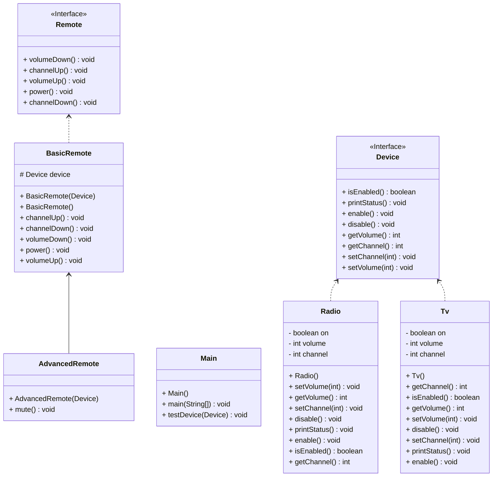

```mermaid
classDiagram
direction BT
class AdvancedRemote {
  + AdvancedRemote(Device) 
  + mute() void
}
class BasicRemote {
  + BasicRemote(Device) 
  + BasicRemote() 
  # Device device
  + channelUp() void
  + channelDown() void
  + volumeDown() void
  + power() void
  + volumeUp() void
}
class Device {
<<Interface>>
  + isEnabled() boolean
  + printStatus() void
  + enable() void
  + disable() void
  + getVolume() int
  + getChannel() int
  + setChannel(int) void
  + setVolume(int) void
}
class Main {
  + Main() 
  + main(String[]) void
  + testDevice(Device) void
}
class Radio {
  + Radio() 
  - boolean on
  - int volume
  - int channel
  + setVolume(int) void
  + getVolume() int
  + setChannel(int) void
  + disable() void
  + printStatus() void
  + enable() void
  + isEnabled() boolean
  + getChannel() int
}
class Remote {
<<Interface>>
  + volumeDown() void
  + channelUp() void
  + volumeUp() void
  + power() void
  + channelDown() void
}
class Tv {
  + Tv() 
  - boolean on
  - int volume
  - int channel
  + getChannel() int
  + isEnabled() boolean
  + getVolume() int
  + setVolume(int) void
  + disable() void
  + setChannel(int) void
  + printStatus() void
  + enable() void
}

AdvancedRemote  -->  BasicRemote 
BasicRemote  ..>  Remote 
Radio  ..>  Device 
Tv  ..>  Device 
```